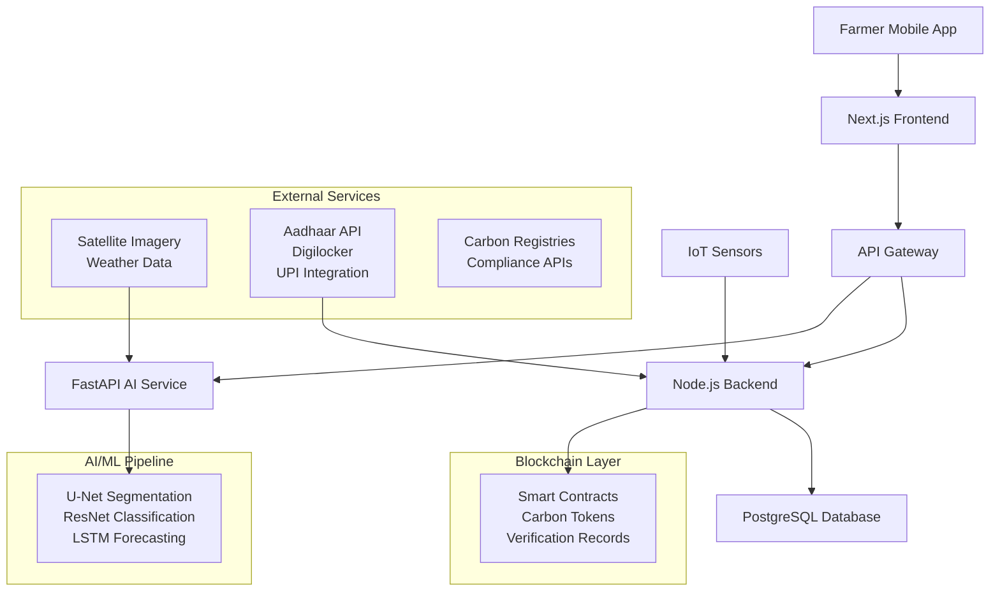

# 🌱 AgriMRV - Carbon Monitoring, Reporting & Verification Platform

<div align="center">


[](https://nextjs.org/)
[](https://nodejs.org/)
[](https://postgresql.org/)
[](https://polygon.technology/)
[](LICENSE)

**Carbon MRV (Measurement, Reporting & Verification) platform for agroforestry and rice-based projects. Uses AI, Blockchain, and DPI APIs for transparent, low-cost, and scalable MRV.**

[🚀 Live Demo](https://agrimrv.demo.com) • [📖 Documentation](docs/) • [🐛 Report Bug](issues/) • [💡 Request Feature](issues/)

</div>

---

## 🚀 Project Overview

AgriMRV is a comprehensive **Carbon Monitoring, Reporting & Verification** platform designed specifically for agricultural and agroforestry projects. Our platform leverages cutting-edge technologies including AI, blockchain, and Digital Public Infrastructure (DPI) APIs to create a transparent, efficient, and scalable solution for carbon credit management.

### 🎯 Key Features

- 🔐 **Farmer Onboarding & KYC** - Seamless registration via Aadhaar eKYC and Digilocker integration
- 🛰️ **AI-Powered Carbon Estimation** - Satellite imagery and ML models for accurate biomass calculation
- ⛓️ **Blockchain Carbon Ledger** - Immutable verification and transparency using Polygon network
- 📊 **Compliance Dashboard** - Real-time MRV monitoring and regulatory compliance
- 💰 **Carbon Credit Marketplace** - Direct trading platform connecting farmers with buyers
- 📱 **Mobile-First Design** - Accessible interface for farmers in rural areas
- 🌍 **Multi-Language Support** - Localized for Indian agricultural communities

### 🏆 Problem We Solve

Traditional carbon credit systems are:
- ❌ Expensive and inaccessible to small farmers
- ❌ Lacking transparency in verification
- ❌ Complex regulatory compliance
- ❌ Limited real-time monitoring

**AgriMRV Solution:**
- ✅ Low-cost, scalable MRV system
- ✅ Blockchain-verified transparency
- ✅ Automated compliance reporting
- ✅ Real-time satellite monitoring

---

## 🏗️ System Architecture

<div align="center">



</div>

### 🔧 Architecture Components

- **Frontend Layer**: Next.js with TailwindCSS for responsive, mobile-first UI
- **API Gateway**: Express.js routing with authentication and rate limiting
- **Backend Services**: 
  - Node.js for core business logic and blockchain integration
  - FastAPI for AI model serving and data processing
- **Database**: PostgreSQL with PostGIS for geospatial data
- **Blockchain**: Polygon network for immutable carbon record storage
- **AI/ML Pipeline**: PyTorch models for satellite image analysis and carbon estimation
- **External Integrations**: DPI APIs for farmer onboarding and verification

---

## ⚙️ Tech Stack

### 🎨 Frontend
- **Framework**: Next.js 15.0 with App Router
- **Styling**: TailwindCSS + Shadcn/UI components
- **State Management**: React Query + Zustand
- **Authentication**: NextAuth.js with JWT
- **Maps**: Leaflet.js for geospatial visualization

### 🔧 Backend
- **API Server**: Node.js + Express.js + TypeScript
- **AI Services**: FastAPI + Python 3.11
- **Database**: PostgreSQL 14+ with PostGIS extension
- **ORM**: Prisma (Node.js) + SQLAlchemy (Python)
- **Authentication**: JWT + OAuth2

### 🤖 AI/ML Stack
- **Deep Learning**: PyTorch 2.0 + CUDA support
- **Computer Vision**: OpenCV + PIL for image processing
- **Models**: 
  - U-Net for satellite image segmentation
  - ResNet50 for crop classification
  - LSTM for time-series carbon forecasting
- **Data Processing**: NumPy + Pandas + GeoPandas

### ⛓️ Blockchain
- **Network**: Polygon Mumbai (Testnet) / Polygon Mainnet
- **Smart Contracts**: Solidity 0.8.19
- **Development**: Hardhat + ethers.js
- **Standards**: ERC-721 for carbon credit NFTs

### 🚀 DevOps & Infrastructure
- **Containerization**: Docker + Docker Compose
- **CI/CD**: GitHub Actions
- **Monitoring**: Prometheus + Grafana
- **Cloud**: AWS / Azure (deployment ready)

---

## 📂 Project Structure

```
agro-mrv/
├── 📁 apps/
│   ├── 📁 web/                    # Next.js Frontend
│   │   ├── 📁 src/
│   │   │   ├── 📁 app/            # App Router pages
│   │   │   ├── 📁 components/     # Reusable UI components
│   │   │   ├── 📁 lib/            # Utilities & configs
│   │   │   └── 📁 pages/          # Page components
│   │   ├── 📄 package.json
│   │   └── 📄 tailwind.config.js
│   │
│   └── 📁 api/                    # Node.js Backend
│       ├── 📁 src/
│       │   ├── 📁 routes/         # API endpoints
│       │   ├── 📁 services/       # Business logic
│       │   ├── 📁 middleware/     # Auth, validation
│       │   └── 📁 utils/          # Helper functions
│       ├── 📄 package.json
│       └── 📄 tsconfig.json
│
├── 📁 ai-services/                # FastAPI AI Backend
│   ├── 📁 models/                 # ML model files
│   ├── 📁 routers/                # FastAPI routes
│   ├── 📁 services/               # AI processing logic
│   ├── 📄 main.py                 # FastAPI app entry
│   └── 📄 requirements.txt
│
├── 📁 contracts/                  # Blockchain Smart Contracts
│   ├── 📁 contracts/             # Solidity files
│   ├── 📁 scripts/               # Deployment scripts
│   ├── 📁 test/                  # Contract tests
│   └── 📄 hardhat.config.js
│
├── 📁 docs/                       # Documentation
│   ├── 📄 architecture.md
│   ├── 📄 api-reference.md
│   └── 📄 deployment.md
│
├── 📁 database/                   # Database schemas & migrations
│   ├── 📄 schema.sql
│   └── 📄 migrations/
│
├── 📄 docker-compose.yml          # Multi-service container setup
├── 📄 package.json               # Root package.json
└── 📄 README.md                  # This file
```

---

## 🔧 Setup Instructions

### 📋 Prerequisites

Before you begin, ensure you have the following installed:

- **Node.js** >= 18.0.0 ([Download](https://nodejs.org/))
- **Python** >= 3.10 ([Download](https://python.org/))
- **PostgreSQL** >= 14 ([Download](https://postgresql.org/))
- **Git** ([Download](https://git-scm.com/))
- **MetaMask Wallet** for blockchain interaction
- **Docker** (optional, for containerized setup)

### 🚀 Quick Start

#### 1️⃣ Clone the Repository

```bash
git clone https://github.com/tejuiceB/AgriMRV.git
cd AgriMRV
```

#### 2️⃣ Environment Setup

Create environment files:

```bash
# Root environment
cp .env.example .env

# Frontend environment
cp apps/web/.env.example apps/web/.env.local

# Backend environment
cp apps/api/.env.example apps/api/.env

# AI services environment
cp ai-services/.env.example ai-services/.env
```

#### 3️⃣ Database Setup

```bash
# Create PostgreSQL database
createdb agromrv

# Install dependencies and run migrations
npm install
npm run db:migrate
```

#### 4️⃣ Install Dependencies

```bash
# Install all dependencies
npm install

# Install Python dependencies for AI services
cd ai-services
pip install -r requirements.txt
cd ..
```

#### 5️⃣ Blockchain Setup (Optional)

```bash
# Deploy smart contracts to testnet
cd contracts
npm install
npx hardhat run scripts/deploy.js --network mumbai
cd ..
```

#### 6️⃣ Start Development Servers

```bash
# Start all services concurrently
npm run dev

# Or start individually:
npm run dev:web        # Frontend (localhost:3000)
npm run dev:api        # Backend API (localhost:4000)
npm run dev:ai         # AI Services (localhost:8000)
```

### 🐳 Docker Setup (Alternative)

```bash
# Build and start all services
docker-compose up --build

# For development with hot reload
docker-compose -f docker-compose.dev.yml up
```

---

## 🌍 Core Features

### 🔐 Farmer Onboarding & KYC

- **Aadhaar eKYC Integration**: Secure identity verification using India's digital identity system
- **Digilocker Document Verification**: Automatic document validation and storage
- **Multi-language Support**: Hindi, English, and regional language support
- **Offline Capability**: Works in low-connectivity rural areas

### 🛰️ AI-Powered Carbon Estimation

- **Satellite Image Analysis**: Automated crop detection and biomass calculation
- **Machine Learning Models**:
  - U-Net for precise crop boundary segmentation
  - ResNet for crop type classification
  - LSTM for carbon sequestration forecasting
- **Ground Truth Validation**: IoT sensor integration for accuracy verification
- **Real-time Monitoring**: Continuous satellite data updates

### ⛓️ Blockchain Carbon Ledger

- **Immutable Records**: All carbon measurements stored on Polygon blockchain
- **Smart Contract Verification**: Automated validation and credit issuance
- **Transparency**: Public verification of all carbon credits
- **Low Transaction Costs**: Polygon's efficient network reduces fees

### 📊 Compliance & Reporting

- **Automated MRV Reports**: Generated according to international standards
- **Audit Trail**: Complete history of all measurements and verifications
- **Regulatory Compliance**: Supports Verra, Gold Standard, and other registries
- **Real-time Dashboard**: Live monitoring of project performance

### 💰 Carbon Credit Marketplace

- **Direct Trading**: Farmers sell directly to buyers
- **Price Discovery**: Market-driven pricing mechanisms
- **Escrow Services**: Secure transaction handling
- **Impact Tracking**: Environmental impact visualization

---

## 📊 API Documentation

### 🔗 Core API Endpoints

#### Authentication & User Management
```http
POST   /api/auth/register        # User registration
POST   /api/auth/login           # User authentication
GET    /api/auth/profile         # Get user profile
PUT    /api/auth/profile         # Update user profile
```

#### Farmer Onboarding
```http
POST   /api/kyc/aadhaar         # Aadhaar verification
POST   /api/kyc/documents       # Document upload via Digilocker
GET    /api/kyc/status          # KYC verification status
```

#### Plot & Land Management
```http
GET    /api/plots               # List farmer's plots
POST   /api/plots               # Create new plot
GET    /api/plots/:id           # Get plot details
PUT    /api/plots/:id           # Update plot information
DELETE /api/plots/:id           # Delete plot
```

#### Tree Monitoring
```http
GET    /api/trees               # List trees by plot
POST   /api/trees               # Add new tree
PUT    /api/trees/:id           # Update tree measurements
GET    /api/trees/:id/history   # Tree growth history
```

#### Carbon Estimation (AI Service)
```http
POST   /api/ai/carbon-estimate  # AI-based carbon calculation
POST   /api/ai/image-analysis   # Satellite image processing
GET    /api/ai/models/status    # AI model health check
```

#### Blockchain Verification
```http
POST   /api/blockchain/record   # Record carbon data on blockchain
GET    /api/blockchain/verify/:id # Verify blockchain record
GET    /api/blockchain/status   # Network status
```

#### Carbon Credits & Marketplace
```http
GET    /api/credits             # List available credits
POST   /api/credits/calculate   # Calculate credit value
POST   /api/marketplace/list    # List credits for sale
POST   /api/marketplace/buy     # Purchase carbon credits
```

### 📖 Interactive API Documentation

- **Swagger UI**: [http://localhost:4000/docs](http://localhost:4000/docs)
- **ReDoc**: [http://localhost:4000/redoc](http://localhost:4000/redoc)
- **Postman Collection**: [Download](docs/AgriMRV.postman_collection.json)

---

## 🔐 Security & Compliance

### 🛡️ Security Measures

- **End-to-End Encryption**: All sensitive data encrypted in transit and at rest
- **OAuth2 + JWT**: Secure authentication with token-based access
- **Rate Limiting**: API protection against abuse
- **Input Validation**: Comprehensive data validation and sanitization
- **RBAC**: Role-based access control for different user types

### 📜 Compliance Standards

- **Carbon Registries**: 
  - Verra VCS (Verified Carbon Standard)
  - Gold Standard
  - Climate Action Reserve
- **Data Protection**: 
  - GDPR compliance for EU users
  - India's Personal Data Protection Act
- **Financial Regulations**: 
  - KYC/AML compliance
  - Transaction monitoring

### 🔍 Audit & Transparency

- **Immutable Audit Trail**: All actions recorded on blockchain
- **Public Verification**: Open verification of carbon credits
- **Third-party Audits**: Support for external auditor access
- **Data Integrity**: Cryptographic proof of data authenticity

---

## 🧪 Testing

### 🔬 Test Coverage

```bash
# Run all tests
npm test

# Frontend tests
npm run test:web

# Backend tests  
npm run test:api

# AI service tests
npm run test:ai

# Integration tests
npm run test:integration

# E2E tests
npm run test:e2e
```

### 📊 Test Reports

- **Unit Tests**: 95%+ coverage for critical functions
- **Integration Tests**: Complete API endpoint coverage
- **E2E Tests**: User workflow validation
- **Performance Tests**: Load testing for scalability

---

## 🚀 Deployment

### 🌐 Production Deployment

#### AWS Deployment
```bash
# Deploy to AWS using CDK
npm run deploy:aws
```

#### Azure Deployment
```bash
# Deploy to Azure using ARM templates
npm run deploy:azure
```

#### Docker Production
```bash
# Build production images
docker-compose -f docker-compose.prod.yml up --build
```

### 📊 Monitoring & Analytics

- **Application Monitoring**: New Relic / DataDog integration
- **Error Tracking**: Sentry for real-time error monitoring
- **Performance**: Lighthouse CI for web vitals
- **Analytics**: Custom dashboard for carbon impact metrics

---

## 📈 Future Roadmap

### 🎯 Short-term (3-6 months)
- [ ] **Mobile App**: React Native app for field data collection
- [ ] **Advanced AI**: LiDAR + satellite data fusion
- [ ] **Multi-crop Support**: Expand beyond agroforestry
- [ ] **Government Integration**: Connect with state carbon registries

### 🌟 Medium-term (6-12 months)
- [ ] **Automated Pricing**: AI-driven carbon credit pricing
- [ ] **Insurance Integration**: Crop insurance based on carbon data
- [ ] **Farmer Training**: Gamified learning platform
- [ ] **Supply Chain Tracking**: End-to-end product traceability

### 🚀 Long-term (1-2 years)
- [ ] **Global Expansion**: Support for international markets
- [ ] **Satellite Constellation**: Dedicated satellite network
- [ ] **Carbon Futures**: Financial derivatives trading
- [ ] **Climate Prediction**: Advanced weather modeling

---

## 👥 Team & Contributors

### 🏆 Core Team

<table>
<tr>
<td align="center">
<a href="https://github.com/tejuiceB">

<br /><sub><b>Tejas</b></sub>
</a>
<br />💻 Full-Stack Development
</td>
<td align="center">
<a href="#">

<br /><sub><b>Team Member</b></sub>
</a>
<br />🤖 AI/ML Engineering
</td>
<td align="center">
<a href="#">

<br /><sub><b>Team Member</b></sub>
</a>
<br />⛓️ Blockchain Development
</td>
</tr>
</table>

### 🤝 Contributing

We welcome contributions! Please see our [Contributing Guidelines](CONTRIBUTING.md) for details.

#### How to Contribute
1. Fork the repository
2. Create a feature branch (`git checkout -b feature/amazing-feature`)
3. Commit your changes (`git commit -m 'Add amazing feature'`)
4. Push to the branch (`git push origin feature/amazing-feature`)
5. Open a Pull Request

#### Areas for Contribution
- 🐛 Bug fixes and improvements
- 📖 Documentation enhancements
- 🌐 Internationalization (i18n)
- 🧪 Test coverage expansion
- 🎨 UI/UX improvements

---

## 📜 License

This project is licensed under the **MIT License** - see the [LICENSE](LICENSE) file for details.

### 📄 Additional Licenses
- **AI Models**: Various open-source licenses (see `ai-services/LICENSE`)
- **Blockchain Contracts**: MIT License
- **Documentation**: Creative Commons Attribution 4.0

---

## 🙏 Acknowledgements

### 🏛️ Government & Standards
- **Digital India Initiative** - DPI API access and support
- **India Stack** - Aadhaar and Digilocker integration
- **Verra & Gold Standard** - Carbon credit methodology guidance

### 🤖 Technology Partners
- **OpenAI & Hugging Face** - Pre-trained model foundations
- **Polygon Technology** - Blockchain infrastructure support
- **Google Earth Engine** - Satellite imagery access
- **Microsoft AI** - Cloud AI services

### 🌱 Agricultural Partners
- **Farmer Producer Organizations (FPOs)** across India
- **Agricultural Universities** for research collaboration
- **NGOs** working in rural development
- **Carbon Registry Organizations** for standards compliance

### 🏆 Special Thanks
- The open-source community for incredible tools and libraries
- Early adopter farmers for valuable feedback
- Carbon market experts for methodology guidance
- Academic researchers for scientific validation

---

<div align="center">

### 🌍 Making Agriculture Climate-Positive, One Farm at a Time

**AgriMRV** © 2025 - Built with ❤️ for farmers and the planet

[🌐 Website](https://agrimrv.com) • [📧 Contact](mailto:contact@agrimrv.com) • [🐦 Twitter](https://twitter.com/agrimrv) • [💼 LinkedIn](https://linkedin.com/company/agrimrv)

</div>
